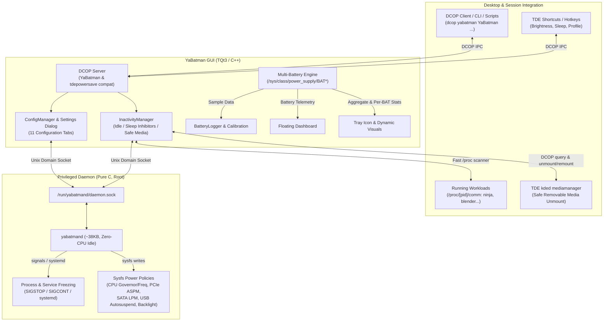
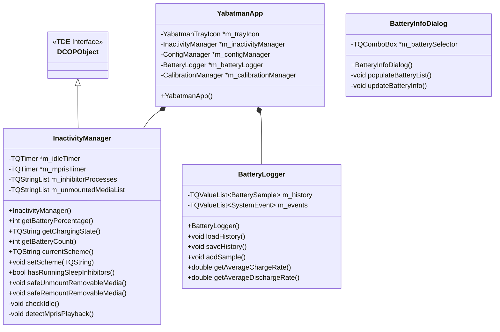

# Yabatman (Yet Another Battery Manager)


**Yabatman** is a comprehensive and highly configurable battery monitor and advanced power management tool for Linux. Built natively for the Trinity Desktop Environment (TQt3), Yabatman can also be compiled in **standalone static mode** to run seamlessly on any standard Linux desktop environment (GNOME, KDE Plasma, XFCE, MATE, LXQt, i3, Hyprland, etc.) without requiring any Trinity or TQt3 system packages.

It combines the exhaustive hardware insights of a premium battery monitor with the aggressive power-saving techniques of advanced daemons like TLP — all in a single, cohesive application.

Designed with both performance and footprint in mind, Yabatman consists of an ultra-lightweight C daemon (`yabatmand`, ~38KB) and a rich, fast C++/TQt3 graphical client (`yabatman`, ~350KB in dynamic mode, ~2.9MB in standalone static mode). Together, they deliver what is probably one of the most feature-complete battery monitor and power management suites available on Linux.

## Philosophy

Most Linux power management solutions are either a graphical battery monitor with limited control, or a CLI-only daemon with no visual feedback or with the need of another ui to control it. Yabatman does both.

- **No polkit, no sudo prompts**: The daemon runs as root via systemd; the GUI communicates through a simple Unix socket. No policy frameworks, no authentication popups — just instant, transparent control.
- **Zero bloat**: Both binaries are compiled with aggressive LTO, section GC, and `sstrip`. The daemon idles at virtually zero CPU. The GUI loads instantly.
- **Universal compatibility**: Can be compiled natively for Trinity (TDE) or in **standalone static mode** (`./build.sh static`) to run on *any* Linux distribution and desktop environment without installing TDE/TQt3 dependencies.
- **Native Trinity DCOP Integration**: Full DCOP IPC interface (`YaBatman`) with transparent backwards-compatibility for legacy `tdepowersave` scripts and keybindings.
- **Multi-Battery Engine**: Full support for multi-battery laptops (e.g., ThinkPads) with energy-weighted aggregate metrics and individual per-battery hardware inspection.
- **Everything in one place**: Battery status, hardware details, charge history, power profiles, process freezing, screen management, screensavers — all accessible from one system tray icon.
- **Fully configurable**: 11 dedicated settings panels let you tune every aspect of power behavior, from USB autosuspend exclusions and sleep inhibitors to per-SSID security policies.

## Key Features

Yabatman aims to be one of the most complete battery and power management suites available on Linux, offering features that range from hardcore system optimization to optional visual candy :-)

### Comprehensive Battery Monitoring
- **Multi-Battery Engine (Dual & Multi-Battery Support)**: Automatically discovers all `/sys/class/power_supply/BAT*` devices. Computes real energy-weighted battery percentage (`sum(energy_now) / sum(energy_full) * 100`) and aggregate discharge/charge rates. Fully supports dual-battery laptops (e.g., ThinkPad bridge battery systems) with combined remaining runtime.
- **Dynamic System Tray Integration**: Fully customizable tray icon with adaptive colors, charging animations, and critical level blinking. Choose between symbolic or coloured icon styles with per-level color configuration.
- **Custom Popup Dashboard**: A sleek, dark/light mode compatible floating panel for quick access to brightness control, performance profiles, and instant metrics (charge rate, discharge rate, estimated time remaining).
- **Exhaustive Battery Info Dialog**: Deep insights into your hardware — Vendor, Technology, Design/Full/Current Capacity, precise Voltage statistics (min/max/current), instantaneous charge/discharge rates in Watts, cycle count, battery health percentage, and manufacturing data. Features a drop-down selector to inspect individual batteries (`BAT0`, `BAT1`, etc.) or global aggregate statistics.
- **Battery History Logger**: A built-in graphical history viewer with a compact binary format. Track charge/discharge curves over 24h, 48h, or 72h periods, overlaid with system suspend events and screen on/off transitions. Average charge/discharge rates are computed from real historical data.

### Advanced Power Management
Yabatman incorporates aggressive power-saving logic inspired by the fantastic work of the **TLP project** (huge thanks to the TLP developers for paving the way in Linux power management). In many areas, Yabatman goes further by offering real-time GUI control and features not available in TLP.

- **Dynamic Profiles**: Three switchable profiles — *Eco*, *Balanced*, and *Performance* — each with independent settings for AC and Battery mode.
- **Extreme Performance Booster**: Optional toggle in Settings -> Advanced to treat the Performance profile as "Extreme/Benchmark" (disabling PCIe ASPM, keeping all PCI devices powered, locking highest CPU clocks). Includes automated safety detection to protect AMD APUs against GPU lockups.
- **CPU Governor & Frequency Control**: Set CPU governor (`powersave`, `performance`, `schedutil`), configure maximum frequency caps, and limit active CPU cores.
- **PCI & SATA Power Policies**: Control PCI device power management (`default` / `power_supersave`) and SATA link power management (`med_power_with_dipm`, `max_performance`, etc.).
- **USB Autosuspend**: Enable/disable USB autosuspend globally with automatic exclusion of HID devices (mice, keyboards) and audio interfaces to prevent input lag.
- **Wi-Fi Power Saving**: Toggle WiFi power management on/off per profile, with auto-disable based on network inactivity.
- **Webcam Power Control**: Automatically unbind/rebind USB webcam drivers to eliminate idle power draw.
- **Backlight Management**: Direct sysfs brightness control with adaptive dimming on inactivity.
- **Services Freezing**: Automatically freeze non-essential systemd services (e.g., `baloo`, `updatedb`, `tracker`) when on battery. Fully configurable whitelist/blacklist.
- **Processes Freezing**: Freeze heavy user-space processes on critical battery. Configurable whitelist/blacklist with regex-based process matching.
- **Sleep Inhibitor Processes**: Fast, zero-overhead `/proc/[pid]/comm` scanner that detects running heavy tasks (e.g., `blender`, `k3b`, `make`, `ninja`, `ffmpeg`, `rsync`, `handbrake`) and automatically inhibits auto-dimming and sleep while active. Managed from its own dedicated **Sleep Inhibitors** tab (placed right under Processes Freezing).
- **Safe Removable Media Unmount on Suspend**: Flushes filesystem buffers (`sync`) and leverages Trinity's `kded` `mediamanager` via DCOP to safely unmount external USB drives and media before suspend, then automatically remounts them upon resume.
- **Smart Inactivity Detection**: Adaptive screen dimming → display sleep → system suspend pipeline with configurable timeouts for AC and Battery independently. Integrated MPRIS detection prevents sleep during media playback, video calls, or presentations.

### Native Trinity DCOP Integration & tdepowersave Compatibility
- **Full DCOP IPC Interface**: Seamless integration with the Trinity Desktop Environment via DCOP (`yabatman YaBatman`). Control profiles, query battery state, adjust screen brightness, trigger suspend/hibernate, or toggle presentation mode directly from shell scripts, terminal commands, or custom window manager hotkeys.
- **Legacy `tdepowersave` Drop-In Replacement**: YaBatman transparently exposes companion DCOP objects (`tdepowersave` and `tdepowersaveIface`). Existing system scripts, shortcuts, and panel applets expecting `tdepowersave` work immediately with YaBatman without modification.

### Security & Session Management
- **Session Locking**: Configurable lock-on-display-off and lock-on-sleep behavior.
- **Trusted SSIDs**: Define trusted Wi-Fi networks where session locking is automatically disabled (e.g., your home network).
- **Power & Sleep Button Actions**: Configure system response to hardware buttons (Sleep, Hibernate, Hybrid Sleep, Shutdown, Ask User, Do Nothing).
- **Lid Close Actions**: Independent lid-close behavior for AC and Battery modes.

### Battery Health & Calibration
- **Charge Limiting**: Hardware-supported charge end thresholds to prolong battery lifespan (e.g., cap charging at 80%). Automatically detects hardware capability.
- **Calibration Assistant**: A dedicated state machine with overlay UI to guide you through full charge/discharge calibration cycles for accurate capacity reporting.

### Visuals & Screensavers (Optional)
Because power management doesn't have to be boring, Yabatman includes optional visual features:
- **7 Built-in Screensavers**: Digital Clock (bouncing), Analog Clock (with sweep second hand and burn-in protection orbit), Matrix Digital Rain, 3D Pipes, Plasma Clouds, Pictures Slideshow (with Ken Burns zoom effect and crossfade transitions), and Starfield Warp.
- **Native Trinity (TDE) Screensavers Integration**: Automatically detects and lists all installed Trinity screensavers (`.kss`) and embeds them securely via X11 `-window-id` with full parent process supervision (`PR_SET_PDEATHSIG` and graceful SIGTERM/SIGKILL cleanup), direct access to each saver's native "Setup..." dialog, and inclusion in the Random screensaver pool.
- **Slideshow Configuration**: Choose image directory, enable random order.
- **Transition Effects**: Smooth sleep/shutdown transition animations — "Old TV turn-off", Circular Wipe, Fade Out, or Random.
- **Presentation Mode**: One-click toggle to suppress all power actions (dimming, sleep, screensaver) during presentations.
- **Powernap Mode**: Prevents system sleep/suspension when closing the laptop lid while connected to AC power. Blackouts the laptop display and applies reduced power settings (Low CPU profile, optional Wi-Fi/Bluetooth disabling) so background tasks (downloads, builds, encoding, background scripts) can continue running safely without overheating or sleeping.

### Appearance & Customization
- **11 Settings Panels**: General, Battery Profile, AC Profile, Adaptive Features, Security, Services Freezing, Processes Freezing, Sleep Inhibitors, Transitions & Screensavers, Appearance, and Advanced.
- **Theme Modes**: Choose between *Follow TDE* (native desktop palette with smart luminance-based icon adaptation), *Light*, or *Dark* mode across all dialogs and panels with automated monochrome icon inversion.
- **Battery Icon Styles**: Select from *Windows 10* (legacy), *Windows 11*, or *Alt* icon sets, supporting symbolic (monochrome) or coloured icons with per-level color customization.
- **Missing Battery Detection**: Clean handling of desktop PCs or laptops without battery: safe AC power profiles, suppression of false alerts, dedicated composite overlay tray icon (`nobat.png`), and clear dashboard reporting.
- **Popup Transparency**: Adjustable popup opacity.


---

## Architecture & Mechanisms

Yabatman is split into two robust components:

1. **`yabatmand` (The Daemon)**: Written in pure C, compiled to a tiny footprint (~38KB). It runs as `root` and handles all privileged operations (sysfs writing for CPU governor/frequency/power policies, USB autosuspend, PCI power management, SATA link policies, backlight control, process freezing via SIGSTOP/SIGCONT, systemd service management, Udev monitoring for AC/battery transitions). It consumes virtually zero CPU cycles while idling, waking only on socket commands or udev events.
2. **`yabatman` (The GUI)**: A native C++/TQt3 application (~350KB). It connects to the daemon via a local Unix socket (`/run/yabatmand/daemon.sock`) with `chmod 0666` permissions — no polkit or sudo required. It handles all complex logic: battery polling, history logging, rendering screensavers, managing inactivity timers, MPRIS detection, and presenting the full settings UI.

> **Technical Deep Dive**: For a complete overview of the power-saving pipeline, internal state machines, timeout calculations, and the GUI ↔ Daemon socket protocol, please refer to the detailed [Energy Management Logic Specification](energy_management_logic.md).

### System & IPC Architecture Diagram



### Class Architecture Diagram



---

## DCOP Remote Control & CLI Automation

When running natively under the Trinity Desktop Environment (TDE), YaBatman registers as a DCOP application under the service identifier `yabatman`. It exposes full programmatic control for shell scripts, terminal commands, cron jobs, or custom desktop shortcuts.

### 1. Primary Interface (`YaBatman`)

```bash
# --- Query Battery Telemetry ---
dcop yabatman YaBatman getBatteryPercentage     # Returns battery percentage: e.g. "87"
dcop yabatman YaBatman getChargingState          # Returns state: "Charging", "Discharging", or "Full"
dcop yabatman YaBatman getBatteryCount          # Returns number of batteries detected: e.g. "2"
dcop yabatman YaBatman getRemainingTimeSec       # Returns remaining battery lifetime in seconds

# --- Power Profile Management ---
dcop yabatman YaBatman listSchemes               # Returns available profiles: "Eco, Balanced, Performance"
dcop yabatman YaBatman currentScheme             # Returns active profile name: e.g. "Balanced"
dcop yabatman YaBatman setScheme "Performance"   # Immediately switches power profile

# --- Display Brightness ---
dcop yabatman YaBatman brightnessGet             # Returns current backlight level (0-100)
dcop yabatman YaBatman brightnessSet 75          # Adjusts display brightness to 75%

# --- Presentation Mode & Sleep Inhibitors ---
dcop yabatman YaBatman hasRunningSleepInhibitors # Returns: true / false
dcop yabatman YaBatman presentationMode          # Returns presentation mode status: true / false
dcop yabatman YaBatman setPresentationMode true  # Toggles presentation mode on/off

# --- Safe Suspend & Hibernate ---
dcop yabatman YaBatman suspend                   # Safe suspend (syncs disks + unmounts USB drives)
dcop yabatman YaBatman hibernate                 # Safe hibernate
```

### 2. Legacy `tdepowersave` Compatibility

To ensure seamless drop-in compatibility with existing scripts, Trinity keybindings, or third-party applets built for `tdepowersave`, YaBatman automatically provides secondary DCOP bindings for `tdepowersave` and `tdepowersaveIface`:

```bash
# Query and change scheme via tdepowersave interface
dcop yabatman tdepowersave scheme
dcop yabatman tdepowersave setScheme "Performance"

# Query battery status
dcop yabatman tdepowersave getBatteryStatus
```

---


## Build & Installation

### Prerequisites

**Build dependencies:**
- CMake >= 3.10
- TQt3 (Trinity Qt3) development headers and `tqmoc`
- TDE development headers (`tdelibs14-trinity-dev` or equivalent)
- `pkg-config`
- Development libraries: `glib-2.0`, `gio-2.0`, `libsystemd`, `libudev`, `libnotify`
- X11 development headers: `libx11-dev`, `libxss-dev`, `libxext-dev`, `libxtst-dev`

**Runtime dependencies (Dynamic TDE mode):**
- `tdelibs14-trinity`, `libtqt3-mt`, `libtqtinterface`
- `libnotify4`, `libudev1`, `libsystemd0`
- `libx11-6`, `libxss1`, `libxext6`, `libxtst6`

**Runtime dependencies (Standalone Static mode):**
- Standard distro libraries only: `libnotify4`, `libudev1`, `libsystemd0`, `libx11-6`, `libxss1`, `libxext6`, `libxtst6` (No TDE or TQt3 packages required!)

---

### Build Modes

Yabatman can be compiled in two modes:

#### 1. Dynamic Mode (Default for TDE)
Builds natively against system TDE/TQt3 libraries. Produces an ultra-compact UI binary (~350KB).

```bash
./build.sh
```

#### 2. Standalone Static Mode (Universal Linux)
Statically embeds TQt3 (`libs/libtqt-mt.a`) into the UI binary and removes all TDE dependencies using pure TQt3 abstraction wrappers. The resulting UI binary (~2.9MB) runs on **any Linux desktop environment** (GNOME, KDE, XFCE, MATE, LXQt, i3, Hyprland, etc.) without installing Trinity or TQt3 packages.

```bash
./build.sh static
```

Yabatman uses highly aggressive compilation flags (LTO, GC sections, `-Os` for UI code, and `sstrip` if available) to ensure minimal binary sizes without sacrificing performance.

---

### Debian Packages (.deb)

You can build `.deb` packages for both modes:

#### Dynamic TDE Package (`yabatman_1.2-5_amd64.deb`)
```bash
./build_deb.sh
sudo dpkg -i yabatman_1.2-5_amd64.deb
```

#### Standalone Static Package (`yabatman_1.2-5_amd64_static.deb`)
```bash
./build_deb.sh static
sudo dpkg -i yabatman_1.2-5_amd64_static.deb
```

The `.deb` package includes:
- **`/usr/bin/yabatman`** — GUI application
- **`/usr/sbin/yabatmand`** — Power management daemon
- **`/usr/share/applications/yabatman.desktop`** — Desktop launcher
- **`/etc/xdg/autostart/yabatman.desktop`** — Session autostart entry
- **`/usr/share/icons/hicolor/*/apps/yabatman.png`** — Application icon

The `postinst` script automatically detects your init system (systemd, sysvinit, OpenRC, runit) and installs, enables, and starts the `yabatmand` daemon service. Removal via `dpkg -r` cleanly stops and uninstalls the service.

---

### Q4OS Installer (.qsi)

For users running the **Q4OS Linux** distribution, you can generate a one-click graphical installer (`.qsi`):

```bash
./build_qsi.sh
```

This script embeds the Debian package and custom graphical setup templates into `yabatman_1.2-5_amd64.qsi`. On Q4OS, users can simply double-click the `.qsi` file to launch the native installation wizard.

---

### Manual Installation (without .deb)

If you prefer a manual install after building:

```bash
# Install binaries
sudo install -m 0755 build/yabatman  /usr/bin/yabatman
sudo install -m 0755 build/yabatmand /usr/sbin/yabatmand

# Create and enable systemd service
sudo tee /etc/systemd/system/yabatmand.service <<EOF
[Unit]
Description=YaBatman Power Management Daemon
After=local-fs.target

[Service]
Type=simple
ExecStart=/usr/sbin/yabatmand
Restart=on-failure
RestartSec=1
TimeoutStopSec=5

[Install]
WantedBy=multi-user.target
EOF

sudo systemctl daemon-reload
sudo systemctl enable --now yabatmand.service
```

### Running for Development

For development/testing without installing system-wide:

```bash
# Start the daemon (requires root)
sudo ./build/yabatmand

# In another terminal, start the GUI
./build/yabatman
```

---

## Regenerating Embedded Icons

All icons displayed by the GUI are embedded directly into the binary at compile time as C byte arrays (no external icon files needed at runtime). If you modify any icon in the `icons/` directory, you must regenerate the header file before rebuilding:

```bash
python3 convert_images.py ./icons/
```

This script:
1. Reads all PNG icons from the specified directory
2. Pre-scales menu icons to their target sizes (24×24 for most, 14×14 for checkmarks) using Lanczos resampling for crisp rendering
3. Generates `src/battery_icons.h` containing the raw PNG byte arrays as C `static const unsigned char[]` data

**Requirements**: Python 3 with `Pillow` (PIL) for menu icon resizing. Without Pillow, icons are embedded at their original resolution.

After regenerating, simply rebuild with `./build.sh`.

---

## Configuration

All user configuration is stored in `~/.config/yabatman/` and managed through the Settings dialog (right-click tray icon → Settings). Battery history data is stored as a compact binary file in the same directory.

The daemon itself is stateless — it receives all profile parameters from the GUI via the Unix socket on each AC/battery transition or profile change.

---

## Acknowledgements

A special thanks to the [TLP](https://linrunner.de/tlp/) project. TLP's extensive documentation and scripting provided immense inspiration for the power-saving strategies implemented within Yabatman. While Yabatman reimplements these strategies natively in C for maximum performance and adds a rich GUI layer, TLP's pioneering work in cataloguing Linux power-saving mechanisms was invaluable.

---

## Screenshots

| | | |
| :---: | :---: | :---: |
| <a href="screenshots/screenshot_popup.jpg"></a> | <a href="screenshots/screenshot_battery_info.jpg"></a> | <a href="screenshots/screenshot_usage_history.jpg"></a> |
| <a href="screenshots/screenshot_settings1.jpg"></a> | <a href="screenshots/screenshot_settings2.jpg"></a> | <a href="screenshots/screenshot_settings3.jpg"></a> |
| <a href="screenshots/screenshot_screensavers.jpg"></a> | <a href="screenshots/screenshot_calibration.jpg"></a> | |


