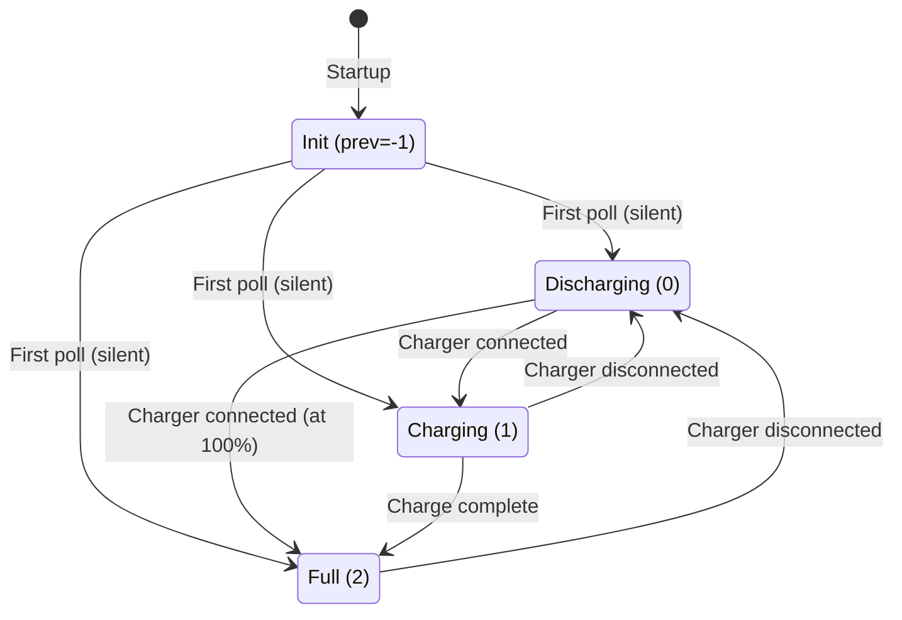
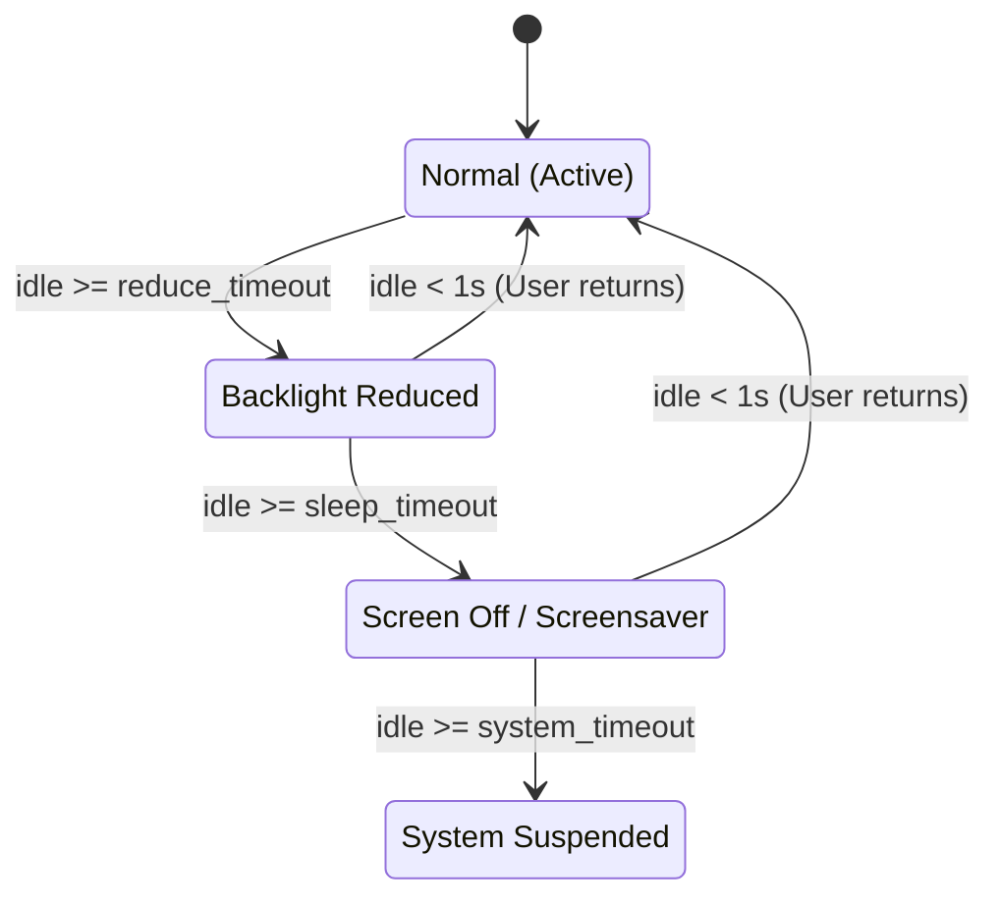

# YaBatman — Core Energy Management Logic Specification

This document serves as the technical reference for the internal energy management, idle tracking, and power state logic implemented in **YaBatman** (TQt3 Client + C Daemon).

---

## 1. Global State Variables

### 1.1 Battery & Charging State

| Variable | Type | Description |
|---|---|---|
| `battery_percentage` | `uint8_t` | Current battery percentage (0-100). |
| `battery_charging` | `uint8_t` | State: **0** = Discharging, **1** = Charging, **2** = Full. |
| `previous_battery_charging` | `int` | Previous charge state for transition detection. Initialized to `-1` to prevent false transitions on startup. |
| `last_batt_percentage` | `uint8_t` | Last known percentage (used for dynamic brightness reduction on discharge). |

### 1.2 Warning Flags

| Variable | Type | Description |
|---|---|---|
| `warn_simple` | `gboolean` | `TRUE` when `battery_percentage <= warn_level` (e.g., 20%) and discharging. Triggers service freezing. |
| `warn_batt` | `gboolean` | `TRUE` when `battery_percentage <= critical_level` (e.g., 10%) and discharging. Triggers process freezing, ultra-low profile. |
| `critical_level_reached` | `uint8_t` | The exact percentage at which the critical level was hit. |
| `x_level` | `uint8_t` | An offset (0 to 3) determining when the final automated critical action (suspend/hibernate) executes. |

### 1.3 Screen & Backlight State

| Variable | Type | Description |
|---|---|---|
| `backlight_reduced` | `gboolean` | `TRUE` if the backlight has been dimmed due to idle timeout. |
| `screen_sleeping` | `gboolean` | `TRUE` if the display is currently in DPMS OFF state. |
| `screensaver_active` | `gboolean` | `TRUE` if a custom screensaver is currently running. |
| `original_brightness` | `int` | Raw Sysfs brightness value saved just before dimming. |
| `brightness_step` | `int` | Calculated dynamically as `max_brightness / 100` (represents 1% in raw values). |

### 1.4 System State

| Variable | Type | Description |
|---|---|---|
| `lid_closed` | `gboolean` | `TRUE` if the laptop lid is closed. |
| `powernap_enabled` | `gboolean` | User preference: whether to enter Powernap on lid close (while on AC). |
| `in_powernap` | `gboolean` | Runtime state: `TRUE` when the system is actively in Powernap mode. |
| `presentation_mode` | `gboolean` | Inhibits display sleep and system suspend when active. |
| `media_playing` | `gboolean` | Set by MPRIS detection (inhibits display sleep for video). |
| `power_profile` | `int` | Current active profile: 0=Low/Eco, 1=Balanced, 2=Performance. |
| `minimal_mode` | `gboolean` | Tracks if the system is in minimal mode (WiFi/BT off, CPU cores disabled) prior to suspending. |

### 1.5 Timers

| Timer | Base Interval | Function |
|---|---|---|
| `idle_timer` | **6s** (drops to **200ms** during sleep) | `check_idle_and_adjust_brightness` |
| `battery_status` | **30s** | Polls `/sys/class/power_supply` |
| `mpris_timer` | **2s** | Detects active media players over D-Bus |

> **Note**: The idle timer dynamically reschedules. It runs at 6 seconds during normal activity to save CPU cycles, but drops to 200ms when the screen is dimmed or asleep to ensure instant wake-up response.

---

## 2. Charge State Transitions (`check_battery_status`)

YaBatman detects charger plug/unplug events dynamically via `udev` or the 30-second polling timer.

**Upon Charger Connection (Discharging → Charging/Full):**
- CPU operation mode switches to `active`.
- Power profile switches to `AC` (Balanced or Performance).
- Ethernet is enabled (if configured to toggle).
- Screen wakes up (`simulate_user_activity()`).
- Brightness transitions upwards (+20% or +30%).
- Notification is displayed.

**Upon Charger Disconnection (Charging/Full → Discharging):**
- CPU operation mode switches to `passive`.
- Power profile switches to `Battery` (Eco or Balanced).
- Ethernet is disabled (if configured to toggle).
- Brightness transitions downwards (-20% or -30%).
- Notification is displayed.

---

## 3. Idle & Power-Saving Pipeline

The idle manager evaluates user inactivity using X11 `XScreenSaverQueryInfo`.

### 3.1 Phase 1: Dimming (Reduce Timeout)
- `original_brightness` is saved.
- Brightness is dropped to 20% of its current value.
- If `reduce_brightness_more_during_idle` is checked, it continues to dim by 1% every 20 seconds.

### 3.2 Phase 2: Screen Sleep / Screensaver
- **On AC**: If a screensaver is configured, it launches over the root window. Otherwise, X11 DPMS is invoked to physically turn off the display.
- **On Battery**: Screensavers are skipped. DPMS turns off the display immediately. If configured, Bluetooth is disabled to save power.

### 3.3 Phase 3: System Suspend
- Triggered when inactivity exceeds `system_timeout`.
- Before suspending, YaBatman may enter `minimal_mode` (disabling CPU cores, blocking radios) to save maximum power during S3 sleep.

---

## 4. Battery Warnings & Critical Safeguards

When discharging, the battery percentage is continually monitored against user thresholds.

### 4.1 Low Level (`warn_level`)
When reached:
- `warn_simple` = `TRUE`
- Heavy background services (e.g., `baloo_file`, `updatedb`) are frozen via D-Bus (SIGSTOP) if configured.
- The power profile is downgraded (e.g., Performance to Balanced).

### 4.2 Critical Level (`critical_level`)
When reached:
- `warn_batt` = `TRUE`
- Power profile is forced to **Ultra Low** (internal level 3, max CPU scaling 20%).
- Bluetooth and Webcams are hard-disabled.
- Additional user processes defined in the blacklist are frozen.
- Brightness is hard-capped at 40%.

### 4.3 Final Automated Action
If the battery continues to drop past the exact `critical_level_reached`, an automated shutdown or hibernate is triggered based on an `x_level` offset (usually 1-3%).

---

## 5. Lid Management & Powernap

When the laptop lid is closed (`handle_lid_close`):
- Any active screensaver is hidden.
- If **AC is connected** and **Powernap is enabled**:
  - The system enters `in_powernap` mode.
  - Idle and MPRIS timers are paused.
  - Radios (WiFi/BT) are disabled.
  - A sound effect is played, and the system stays awake (e.g., for background downloads with lid closed).
- If **On Battery** (or Powernap disabled):
  - The configured `lid_action` (Suspend, Hibernate, Lock, Do Nothing) is executed synchronously.

When the lid is opened, the system exits Powernap, restores radios, locks the screen if configured, and re-enables all timers.

---

## 6. GUI ↔ Daemon Communication (Architecture)

To apply aggressive power management safely, YaBatman relies on a split architecture:

1. **`yabatman` (Client / GUI)**: Runs as the logged-in user. Handles the UI, X11 idle tracking, screensaver drawing, battery polling, and threshold logic.
2. **`yabatmand` (Daemon)**: Written in C, runs as `root`. Receives simple commands from the GUI via a local UNIX socket (`/run/yabatmand/daemon.sock`).

### Daemon Command Protocol
Commands are sent as strings formatted as `command:argument\n`.
Key daemon capabilities include:
- `set_perf_profile`, `set_normal_profile`, `set_low_profile:0|1` (CPU scaling via `cpufreq` and `intel_pstate`/`amd_pstate`).
- `disable_cpu_cores` / `reenable_cpu_cores` (Takes all cores offline except CPU0).
- `freeze_services_dbus` / `unfreeze_all_frozen_services` (Freezes systemd services).
- `set_rfkill_state:type:0|1` (Soft-blocks Bluetooth/WiFi).
- `toggle_ethernet:0|1` (Interfaces with `ip link`).

By keeping the heavy lifting (UI and tracking) in user-space and only dispatching targeted privileged commands to the daemon, YaBatman achieves maximum security and minimal resource footprint.
